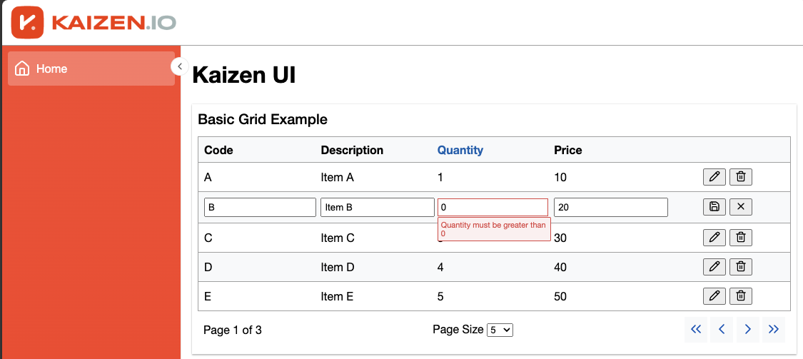

# Kaizen.UI

Kaizen.UI is a Blazor component library providing reusable UI components and patterns for building web applications.



## Installation

1. Copy the `Kaizen.UI` project into your solution
2. Add the project reference to your application's .csproj file:
   ```xml
   <ProjectReference Include="..\path\to\Kaizen.UI\Kaizen.UI.csproj" />
   ```
3. Reference the stylesheet
    ```html
    <link rel="stylesheet" href="@Assets["_content/Kaizen.UI/kaizen-ui.css"]" />
    ```
4. Add the following to your `_Imports.razor` file:
    ```html
    @using Kaizen.UI.Components
    @using Blazicons
    ```

## Components

### Layout Components

#### MainLayout
A responsive layout component with header, sidebar, and main content areas.

```html
@inherits LayoutComponentBase

<Toaster />

<div class="layout">
    <header>
        <a href="/" class="logo"></a>
    </header>
    <aside>
        <LeftNavWrapper @rendermode="InteractiveWebAssembly" />
    </aside>
    <main>
        @Body
    </main>
</div>
```

### Data Display Components

#### DataGrid
A grid with configuration options for sorting and grouping

```html
<DataGrid Items="_data" Pagination="_pagination" GroupBy="_groupBy">
    <Header>
        <GridColumnHeader Name="Code"/>
        <GridColumnHeader Name="Description"/>
        <GridColumnHeader Name="Quantity" Sort="x => x.Price"/>
        <GridColumnHeader Name="Price"/>
        <GridColumnHeader />
    </Header>
    <RowTemplate Context="workItem">
        <span>@workItem.Code</span>
        <span>@workItem.Description</span>
        <span>@workItem.Quantity</span>
        <span>@workItem.Price</span>
    </RowTemplate>
</DataGrid>
<Paginator Pagination="_pagination" />
```

#### DataGrid with Inline Editing
A grid with inline editing and validation.

```html
<DataGrid Items="_data" Pagination="_pagination" GroupBy="_groupBy">
    <Header>
        <GridColumnHeader Name="Code"/>
        <GridColumnHeader Name="Description"/>
        <GridColumnHeader Name="Quantity" Sort="x => x.Price"/>
        <GridColumnHeader Name="Price"/>
        <GridColumnHeader />
    </Header>
    <RowTemplate Context="workItem">
        <Editable Item="workItem" OnActionCompleted="OnActionCompleted" TItem="WorkItem">
            <ReadTemplate>
                <span>@workItem.Code</span>
                <span>@workItem.Description</span>
                <span>@workItem.Quantity</span>
                <span>@workItem.Price</span>
            </ReadTemplate>
            <EditTemplate Context="updatedItem">
                <div>
                    <InputText type="text" @bind-Value="@updatedItem.Code"/>
                    <ValidationMessage For="() => updatedItem.Code"/>
                </div>
                <input type="text" @bind="updatedItem.Description" @bind:event="oninput" />
                <div>
                    <InputNumber @bind-Value="@updatedItem.Quantity"/>
                    <ValidationMessage For="() => updatedItem.Quantity"/>
                </div>
                <input type="number" @bind="updatedItem.Price" @bind:event="oninput" />
            </EditTemplate>
        </Editable>
    </RowTemplate>
</DataGrid>
<Paginator Pagination="_pagination" />
```

### Notification Components

#### Toaster
A toast notification system for displaying alerts and messages.

```csharp
builder.Services.AddSingleton<ToastService>();
```

```csharp
@inject ToastService Toast
<Toaster />

@code {
    private void ShowToast() {
        Toast.ShowToast("This is a toast message", ToastLevel.Success);
    }
}
```

### Container Components

#### Panel
A container component with optional header for grouping related content.

```html
<div class="panel">
    <header class="heading">
        <span>Panel Title</span>
    </header>
    <!-- Content goes here -->
</div>
```

## Requirements

- .NET 8.0 or later
- Blazor WebAssembly support

## Other Projects

This project uses `Blazicons.Lucide` for icons.  More on that [here](https://github.com/kyleherzog/Blazicons.Lucide?tab=readme-ov-file).

## Contributing

Feel free to submit issues and enhancement requests.

## License

[Your chosen license here]